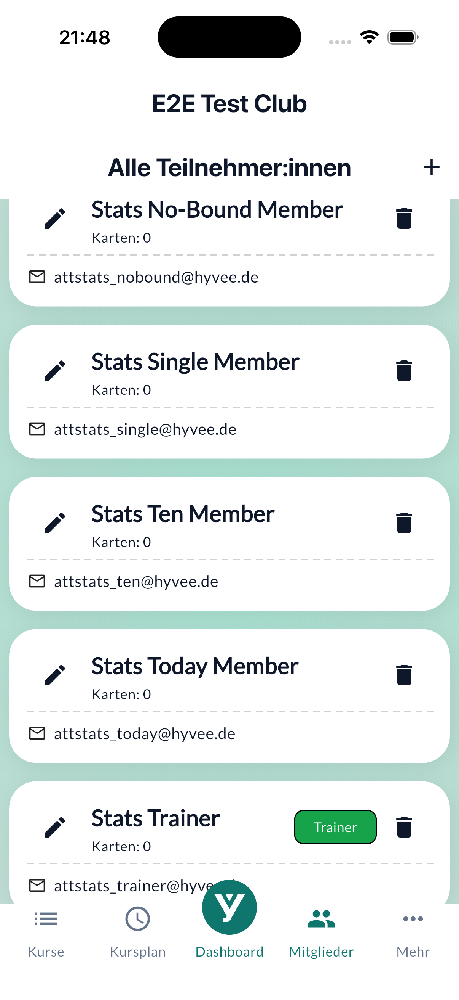

# Home Screen

This chapter covers the main screen of the app — the only screen you'll see when you open it.

---

### Flutter Demo Home Page {#home}

*The home screen shows a counter in the centre of the display and a button at the bottom right.*

The home screen displays a running count of how many times you have pressed the button. When you first open the app, the count starts at zero.

**To increase the counter:**

1. Open the app. You will see the text "You have pushed the button this many times:" followed by the current count.
2. Tap the **Increment** button — the round button with a plus icon in the bottom-right corner of the screen.
3. The number on screen increases by one each time you tap.

> **Tip:** The counter resets to zero if you fully close and restart the app.

**Buttons on this screen:**

| Button | What it does |
|--------|--------------|
| **Increment** (plus icon, bottom right) | Adds one to the counter each time you tap it |

> See also: [How to use the counter](../journeys/counter-interaction.md)

---

[← Back to manual](../index.md)
