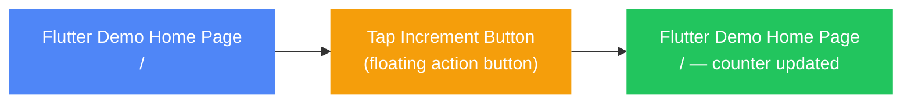

# How to: Counter Interaction

This walkthrough shows you how to use the counter — from opening the app to tapping the button and watching the number go up.

---

## Steps

1. **[Open the home screen](../chapters/home.md#home)** — The app opens straight to the home screen. You will see the message "You have pushed the button this many times:" with the number **0** displayed below it.
2. **[Tap the Increment button](../chapters/home.md#home)** — Tap the round button with the plus icon in the bottom-right corner of the screen. The counter increases by one immediately.

> **Tip:** You can tap the **Increment** button as many times as you like. The counter keeps going up with every tap.

---

## Flow

[View as SVG](../../diagrams/counter-interaction.svg)

---

## What you'll see at the end

After tapping the **Increment** button, the number in the centre of the screen updates instantly to reflect the new total. Each additional tap raises the count by one. The updated number stays on screen until you close the app.

---

[← Back to manual](../index.md)
